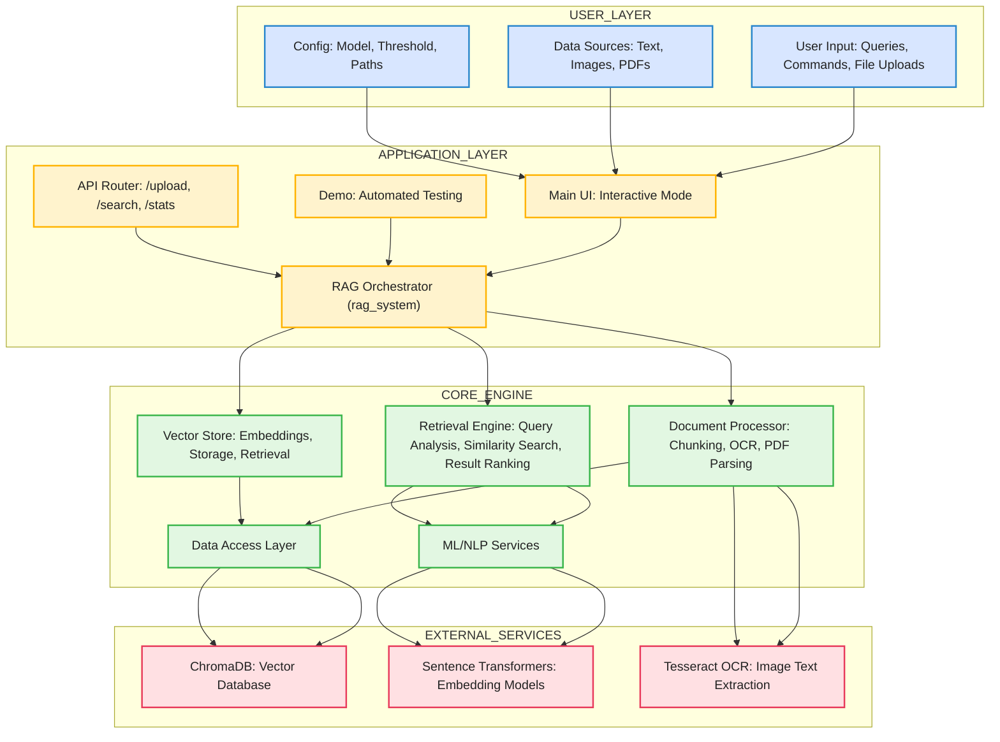

# 🌐 Multimodal RAG System

A powerful **Multimodal Retrieval-Augmented Generation (RAG)** system that processes and queries multiple data formats including text documents, images, and PDFs with mixed content. Built for the AI Engineering Intern assignment with production-ready architecture.

## 🧑‍💻 About the Project

The **Multimodal RAG System** is designed to process and query diverse data formats, including text documents, images, and PDFs. By leveraging advanced **Retrieval-Augmented Generation (RAG)** techniques, the system retrieves and synthesizes information from various data sources and formats, enhancing the response generation process.

The system is built using **Python** and integrates several powerful tools, including:

- **ChromaDB** 🗃️ for efficient vector storage and retrieval.
- **Tesseract OCR** 🖼️ for extracting text from images.
- **Semantic Search** 🔍 algorithms for relevance scoring and advanced query analysis.
- **YAML Configuration** ⚙️ for flexible, easy-to-modify system settings.

This project is built with a focus on **scalability** 📈 and **production-readiness** 🛠️, making it suitable for AI Engineering Intern assignments, research, or production-level AI systems.

## 🚀 Features

- **📄 Multimodal Processing**: Handle text, images, and PDFs with embedded content
- **🔍 Semantic Search**: Advanced vector similarity search with relevance scoring
- **💾 Vector Database**: ChromaDB for efficient document storage and retrieval
- **🎯 Query Analysis**: Intelligent query type detection (factual, exploratory, cross-modal)
- **🖼️ OCR Integration**: Extract text from images using Tesseract OCR
- **📊 Rich Interface**: Beautiful console interface with color-coded results
- **⚙️ Configurable**: YAML-based configuration for easy customization

## 🏗️ Architecture Diagram

# 🧠 Core Components of the Multimodal RAG System

The **Multimodal RAG System** is built with several core components that enable seamless processing of diverse data types (text, images, PDFs) and efficient retrieval of relevant information.

## 1. 📝 Document Processor

- **Purpose**: Prepares raw data (text, images, PDFs) for processing.
- **Tasks**:
  - Extracts text from images (using **OCR**).
  - Parses and chunks PDF and text documents for easier processing.

## 2. 📊 Vector Store

- **Purpose**: Converts documents into numerical representations (vectors) and stores them.
- **Tasks**:
  - Converts text into vectors (using **Sentence Transformers**).
  - Stores vectors for easy retrieval and comparison.

## 3. 🔍 Retrieval Engine

- **Purpose**: Finds the most relevant documents based on the user's query.
- **Tasks**:
  - Analyzes the query and searches for similar documents using vectors.
  - Ranks the results by relevance.

## 4. 💾 Data Access Layer

- **Purpose**: Manages data and ensures smooth interaction between components.
- **Tasks**:
  - Provides easy access to stored documents and embeddings.

## 5. 🧠 ML/NLP Services

- **Purpose**: Enhances the search and query understanding with AI models.
- **Tasks**:
  - Improves query understanding and response quality using machine learning models.
